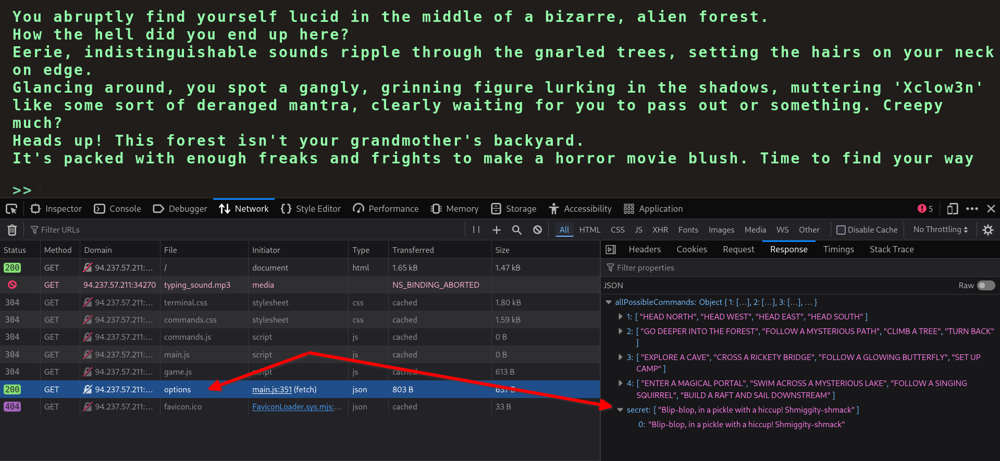
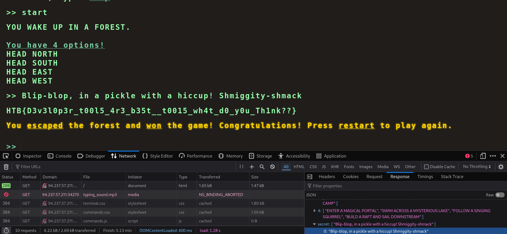

http://94.237.57.211:34270/ reveals a text-based dungeon crawler.

- Open up Developer Tools > Network 
	- select `options`, then `Response` to see the available options.
	- There is a `secret` input: `Blip-blop, in a pickle with a hiccup! Shmiggity-shmack`

- Input `start` to start the game, then input the secret string to get the flag 
