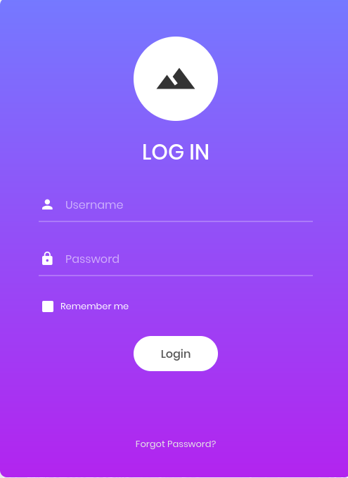

Browsing to http://10.129.79.243/ shows a login page.

## Brute-force attempts
- injection attempts courtesy of  https://github.com/haxneeraj/admin-authentication-bypass-sql-injection-cheat-sheet

| username  | password | access? |
| --------- | -------- | ------- |
| root      | root     |         |
| guest     | guest    |         |
| admin     |          |         |
| root      |          |         |
| admin' -- | fefewf   |         |
| admin' #  | fewfewf  | yes     |

