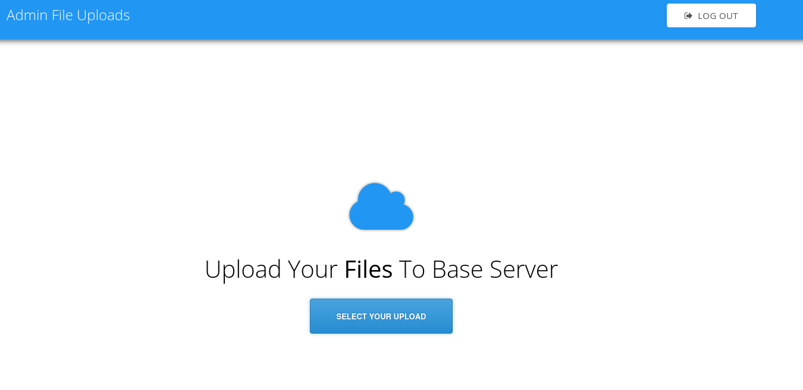

http://10.129.95.184/
Shows a file hosting service.

- Wappalyzer points to some javascript libraries.
- `Contact` has a form to fill out.
- There is also a `Subscribe` button
- email: info@base.htb

http://10.129.95.184/login/login.php seems promising
- Inputting bad credentials gives a `Wrong Username or Password` popup.
- There is an /upload.php which redirects to /login.php, perhaps there's a way to upload a shell after logging in.




http://10.129.62.166/login/ lists more directories :)
- http://10.129.62.166/login/config.php
- http://10.129.62.166/login/login.php.swp
	- When this URL was entered, login.php.swp was downloaded.

## login.php.swp
```
┌──(kali㉿kali)-[~/…/HackTheBox/Retired Machines/Base/10 - loot]
└─$ file login.php.swp  
login.php.swp: Vim swap file, version 8.0, pid 1648, user root, host base, file /var/www/html/login/login.php

┌──(kali㉿kali)-[~/…/HackTheBox/Retired Machines/Base/10 - loot]
└─$ strings login.php.swp  
b0VIM 8.0
root
base
/var/www/html/login/login.php
3210
#"! 
                  <input type="text" name="username" class="form-control" style="max-width: 30%;" id="username" placeholder="Your Username" required>
                <div class="form-group">
              <div class="row" align="center">
            <form id="login-form" action="" method="POST" role="form" style="background-color:#f8fbfe">
          <div class="col-lg-12 mt-5 mt-lg-0">
        <div class="row mt-2">
        </div>
          <p>Use the form below to log into your account.</p>
          <h2>Login</h2>
        <div class="section-title mt-5" >
      <div class="container" data-aos="fade-up">
    <section id="login" class="contact section-bg" style="padding: 160px 0">
    <!-- ======= Login Section ======= -->
  </header><!-- End Header -->
    </div>
      </nav><!-- .navbar -->
        <i class="bi bi-list mobile-nav-toggle"></i>
        </ul>
          <li><a class="nav-link scrollto action" href="/login.php">Login</a></li>
          <li><a class="nav-link scrollto" href="/#contact">Contact</a></li>
          <li><a class="nav-link scrollto" href="/#pricing">Pricing</a></li>
          <li><a class="nav-link scrollto" href="/#team">Team</a></li>
          <li><a class="nav-link scrollto" href="/#services">Services</a></li>
          <li><a class="nav-link scrollto" href="/#about">About</a></li>
          <li><a class="nav-link scrollto" href="/#hero">Home</a></li>
        <ul>
      <nav id="navbar" class="navbar">
      <!-- <a href="index.html" class="logo"></a>-->
      <!-- Uncomment below if you prefer to use an image logo -->
      <h1 class="logo"><a href="index.html">BASE</a></h1>
    <div class="container d-flex align-items-center justify-content-between">
  <header id="header" class="fixed-top">
  <!-- ======= Header ======= -->
<body>
</head>
  <link href="../assets/css/style.css" rel="stylesheet">
  <!-- Template Main CSS File -->
  <link href="../assets/vendor/swiper/swiper-bundle.min.css" rel="stylesheet">
  <link href="../assets/vendor/remixicon/remixicon.css" rel="stylesheet">
  <link href="../assets/vendor/glightbox/css/glightbox.min.css" rel="stylesheet">
  <link href="../assets/vendor/boxicons/css/boxicons.min.css" rel="stylesheet">
  <link href="../assets/vendor/bootstrap-icons/bootstrap-icons.css" rel="stylesheet">
  <link href="../assets/vendor/bootstrap/css/bootstrap.min.css" rel="stylesheet">
  <link href="../assets/vendor/aos/aos.css" rel="stylesheet">
  <!-- Vendor CSS Files -->
  <link href="https://fonts.googleapis.com/css?family=Open+Sans:300,300i,400,400i,600,600i,700,700i|Raleway:300,300i,400,400i,500,500i,600,600i,700,700i|Poppins:300,300i,400,400i,500,500i,600,600i,700,700i" rel="stylesheet">
  <!-- Google Fonts -->
  <link href="../assets/img/apple-touch-icon.png" rel="apple-touch-icon">
  <link href="../assets/img/favicon.png" rel="icon">
  <!-- Favicons -->
  <meta content="" name="keywords">
  <meta content="" name="description">
  <title>Welcome to Base</title>
  <meta content="width=device-width, initial-scale=1.0" name="viewport">
  <meta charset="utf-8">
<head>
<html lang="en">
<!DOCTYPE html>
    }
        print("<script>alert('Wrong Username or Password')</script>");
    } else {
        }
            print("<script>alert('Wrong Username or Password')</script>");
        } else {
            header("Location: /upload.php");
            $_SESSION['user_id'] = 1;
        if (strcmp($password, $_POST['password']) == 0) {
    if (strcmp($username, $_POST['username']) == 0) {
    require('config.php');
if (!empty($_POST['username']) && !empty($_POST['password'])) {
session_start();
<?php
</html>
</body>
  <script src="../assets/js/main.js"></script>


```