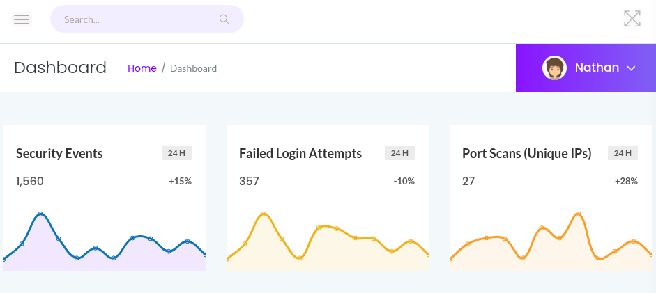
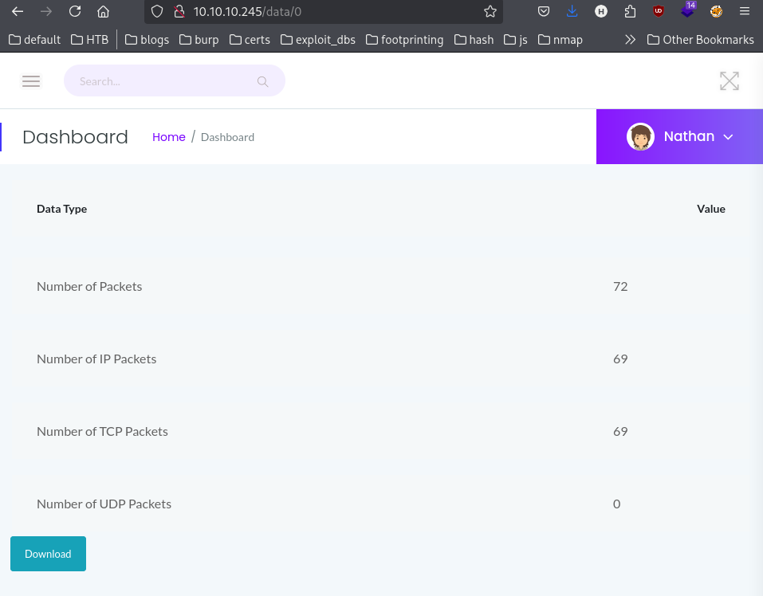
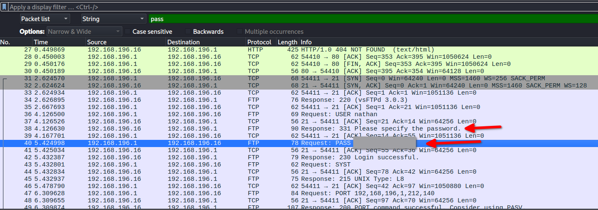

- http://10.10.10.245/# - landing page, logged in as nathan

A hamburger menu gives other areas to navigate to
- http://10.10.10.245/data/1 - security snapshots and pcap analysis
- http://10.10.10.245/ip - shows ip output
- http://10.10.10.245/netstat - netstat output

## Security Snapshots URL
http://10.10.10.245/data/1 doesn't show any data available, but there is a Download button.

### Enumerating for IDOR
Decrementing the number gives a valid URL to download pcap data: http://10.10.10.245/data/0

### Inspecting pcaps
#### 01
Shows an ftp password

