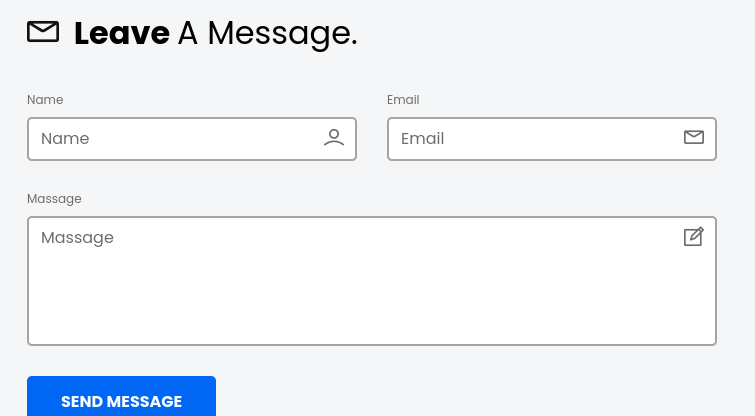
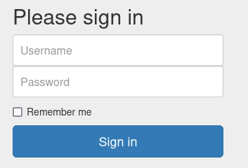
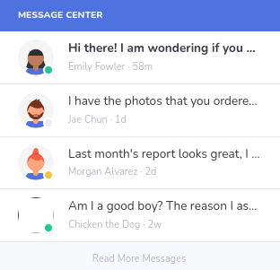

# Manual inspection
http://10.129.1.15/ reveals a digital product page

There is a form to leave a message:

Team shows potential users/admins. This is likely from a template, but might be good info to have:
- ~~Jeffery Riley (Art Director)~~
- ~~Riley Beata (Web Developer)~~
- ~~Mark A. Parker  (UX Designer)~~

See [[03- FTP]] for a more accurate list of users and potential passwords

## Logging in
Based on [[Crocodile/02 - Enumeration|02 - Enumeration]] gobuster results, there is a login page.

Sure enough: http://10.129.1.15/login.php

#### Attempts

| username | passwords        | success? |
| -------- | ---------------- | -------- |
| aron     | all              | no       |
| pwnmeow  | all              | no       |
| admin    | rKXM59ESxesUFHAd | yes      |

Logging in redirects to a dashboard with the flag:
http://10.129.1.15/dashboard/index.php

Bonus: 'Chicken the Dog' wants to know if he is a good boy. Of course!

