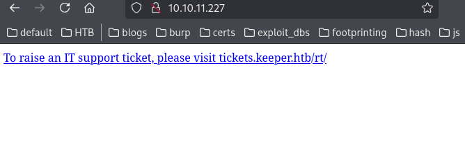
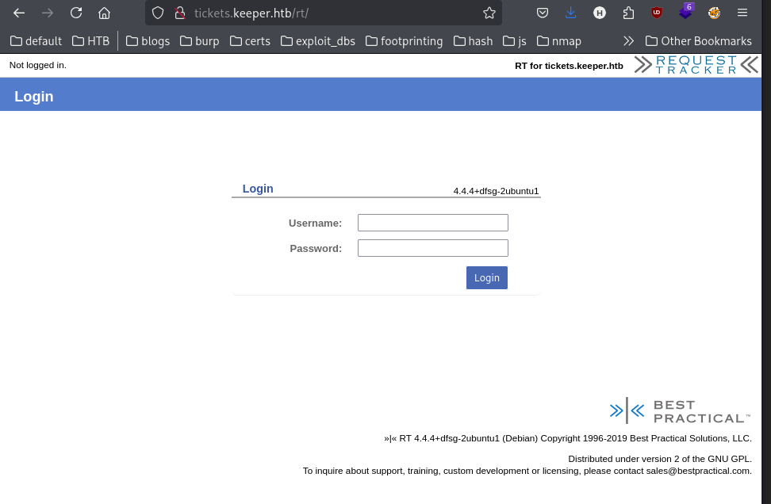
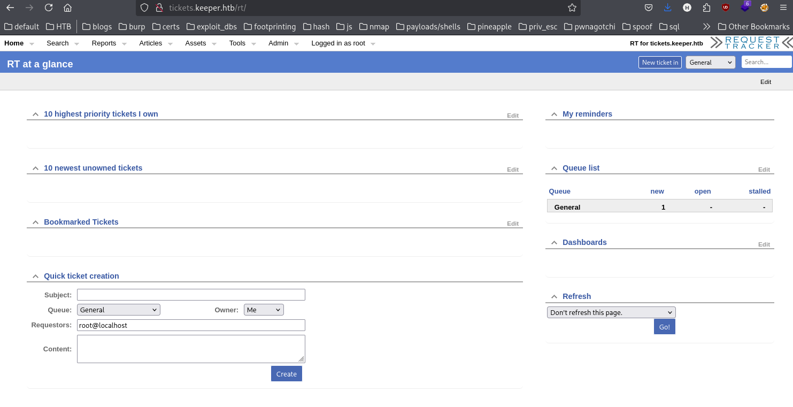
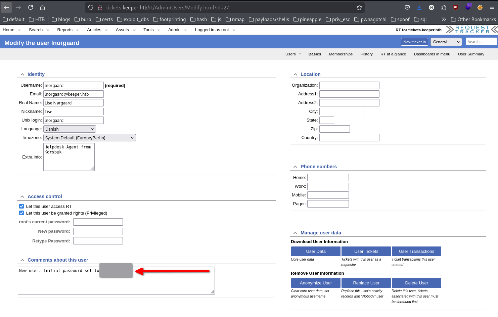

- http://10.10.11.227/ - landing page showing a link to open support tickets


Appended URLs to `/etc/hosts`
```
└─$ cat /etc/hosts | grep keeper              
10.10.11.227     keeper.htb tickets.keeper.htb

```

- http://tickets.keeper.htb/rt/ - login page for support tickets. Uses [Request Tracker](https://requesttracker.com/).

Wappalyzer notes CKEditor, nginx 1.18.0.

Request Tracker version: RT 4.4.4+dfsg-2ubuntu1 (Debian)

Logging in with incorrect credentials redirects to http://tickets.keeper.htb/rt/NoAuth/Login.html and says `Your username or password is incorrect`

## Logging in
The page uses [Request Tracker default credentials](https://rt-wiki.bestpractical.com/wiki/RecoverRootPassword), and the attacker can log in with root:password



http://tickets.keeper.htb/rt/Admin/Users/
- users
	- [lnorgaard](http://tickets.keeper.htb/rt/Admin/Users/Modify.html?id=27)
	- [root](http://tickets.keeper.htb/rt/Admin/Users/Modify.html?id=14)



- New user. Initial password set to `W<SNIP>3!`
- lnorgaard@keeper.htb

## Popping a shell
```
└─$ ssh lnorgaard@keeper.htb                        
The authenticity of host 'keeper.htb (10.10.11.227)' can't be established.
ED25519 key fingerprint is SHA256:hczMXffNW5M3qOppqsTCzstpLKxrvdBjFYoJXJGpr7w.
This key is not known by any other names.
Are you sure you want to continue connecting (yes/no/[fingerprint])? yes
Warning: Permanently added 'keeper.htb' (ED25519) to the list of known hosts.
lnorgaard@keeper.htb's password: 
Welcome to Ubuntu 22.04.3 LTS (GNU/Linux 5.15.0-78-generic x86_64)

 * Documentation:  https://help.ubuntu.com
 * Management:     https://landscape.canonical.com
 * Support:        https://ubuntu.com/advantage
You have mail.
Last login: Tue Aug  8 11:31:22 2023 from 10.10.14.23
lnorgaard@keeper:~$ 

```