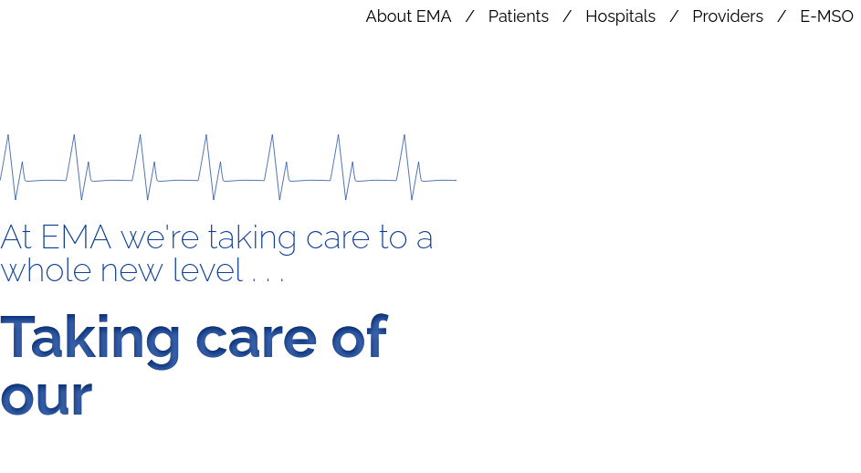

Wappalyzer shows php 8.1.0 , Apache
- http://10.10.10.242/ - landing page for a medical provider

There doesn't seem to be much here.

Looking at potential php exploits...
https://www.exploit-db.com/exploits/49933
Got a shell as `james`, see [04 - shell -james](04%20-%20shell%20-james.md)
