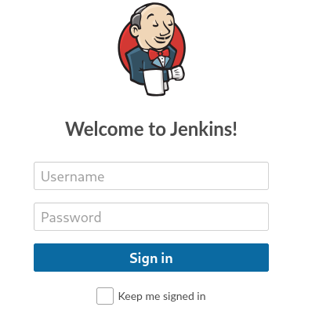
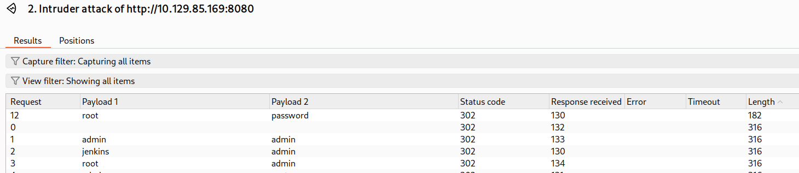
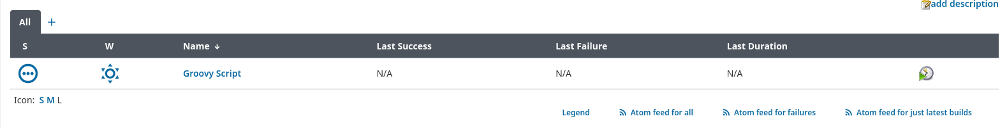
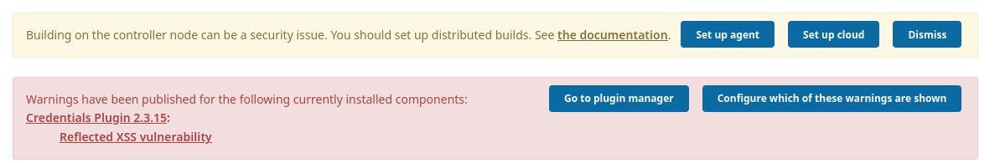

Pages
- The landing page redirects to http://10.129.39.125:8080/login?from=%2F
	- decoding the URL, this translates to `login?from=/`




### Logging in
Jenkins generates a password when the server is initially created, so there is no default.
Brute-forcing seems like the only way in.

Burpsuite catches this:
`j_username=foo&j_password=bar&from=&Submit=Sign+in`

### credentials



root:password

## Dashboard
[Jenkins 2.289.1](https://jenkins.io/)

The page shows a groovy script 


The description reads:
```
# Project Groovy Script

We've been made aware that the Groovy Script (Script Console) is insecure and must be disabled.
```

There is also security warning on the dashboard:



#### CVE warning
https://www.jenkins.io/security/advisory/2021-05-11/#SECURITY-2349
```
### Reflected XSS vulnerability in Credentials Plugin[](https://www.jenkins.io/security/advisory/2021-05-11/#SECURITY-2349)

**SECURITY-2349 / CVE-2021-21648**  
**Severity (CVSS):** [High](https://www.first.org/cvss/calculator/3.1#CVSS:3.1/AV:N/AC:L/PR:N/UI:R/S:U/C:H/I:H/A:H)  
**Affected plugin: [`credentials`](https://plugins.jenkins.io/credentials)**  
**Description:**

Credentials Plugin 2.3.18 and earlier does not escape user-controlled information on a view it provides.

This results in a reflected cross-site scripting (XSS) vulnerability.

Credentials Plugin 2.3.19 restricts the user-controlled information it provides to a safe subset.
```
