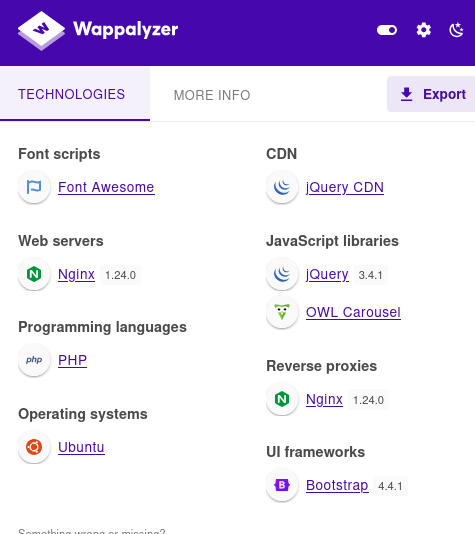
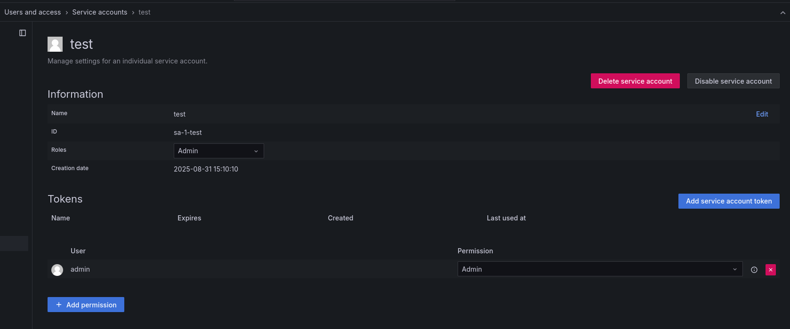

- http://planning.htb/ - landing page, search for classes
- http://planning.htb/detail.php
- http://planning.htb/enroll.php - name/email/phone number field
	- test input says `Successful registration - Thank you!`
- http://planning.htb/contact.php - send a message
- http://grafana.planning.htb/login
	- a login page!

- potential email
	- info@planning.htb
- Potential users
	- http://planning.htb/course.php (teachers)
	- Stella Haks
	- Rose Mary
	- Bob Moss

Some of the page source code is in spanish
```
 <!-- Mostrar los resultados debajo de la barra de búsqueda -->
 Translation: show results below the search bar
```

## Wappalyzer


# http://grafana.planning.htb/
A login page allows the provided admin credentials to be used. Just make sure the correct entry is in /etc/hosts.

### Version
Grafana v11.0.0 (83b9528bce)

https://grafana.com/blog/2024/10/17/grafana-security-release-critical-severity-fix-for-cve-2024-9264/

## CVE-2024-9264

### Looking at service accounts
http://grafana.planning.htb/org/serviceaccounts
Created service account named `test`


Service account token created:
`gls<SNIP>7024bb24`

Creating a service account was not necessary, but part of exploration.
