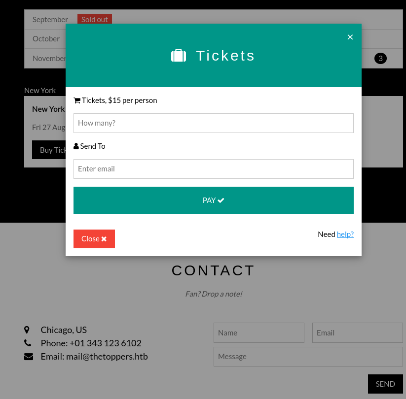
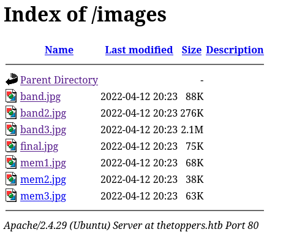

http://10.129.166.187/ shows a band webpage for 'The Toppers'.
- Potential users on page
	- John Smith
	- Shane Marks
	- Jim Tailer

- http://10.129.166.187/#tour 
	- has a contact page with name, email, and message fields
	- an email: mail@thetoppers.htb
	- An option to buy tickets
		- 
		- 
	- 

```
┌──(kali㉿kali)-[~]
└─$ cat /etc/hosts | grep toppers
10.129.166.187   thetoppers.htb
```

There is an images dir to browse:
http://thetoppers.htb/images/



Fuzzing for subdirectories with gobuster revealed:
- http://s3.thetoppers.htb

Adding it to /etc/hosts:
```
┌──(kali㉿kali)-[~]
└─$ cat /etc/hosts | grep toppers                          
10.129.81.137   s3.thetoppers.htb
```

Curling:
```
┌──(kali㉿kali)-[~]
└─$ curl -I s3.thetoppers.htb
HTTP/1.1 404 
Date: Mon, 11 Aug 2025 12:27:45 GMT
Server: hypercorn-h11
Content-Type: text/html; charset=utf-8
Content-Length: 21
Access-Control-Allow-Origin: *
Access-Control-Allow-Methods: HEAD,GET,PUT,POST,DELETE,OPTIONS,PATCH
Access-Control-Allow-Headers: authorization,cache-control,content-length,content-md5,content-type,etag,location,x-amz-acl,x-amz-content-sha256,x-amz-date,x-amz-request-id,x-amz-security-token,x-amz-tagging,x-amz-target,x-amz-user-agent,x-amz-version-id,x-amzn-requestid,x-localstack-target,amz-sdk-invocation-id,amz-sdk-request
Access-Control-Expose-Headers: etag,x-amz-version-id


```