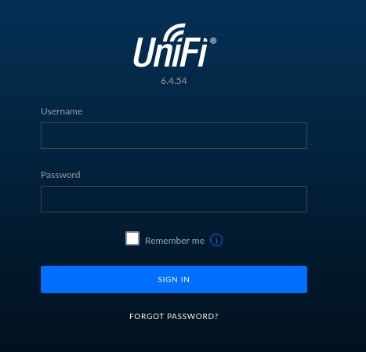
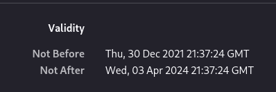
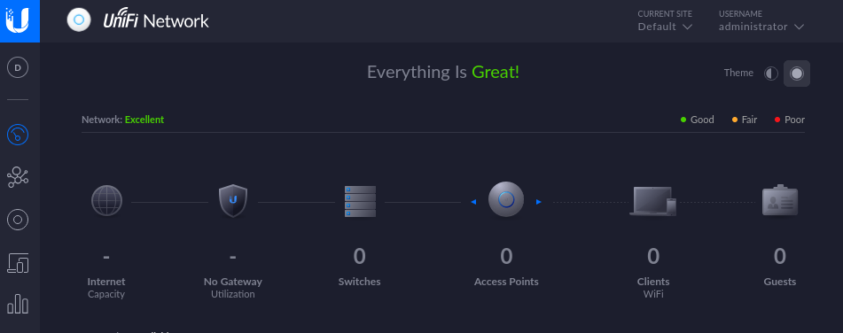
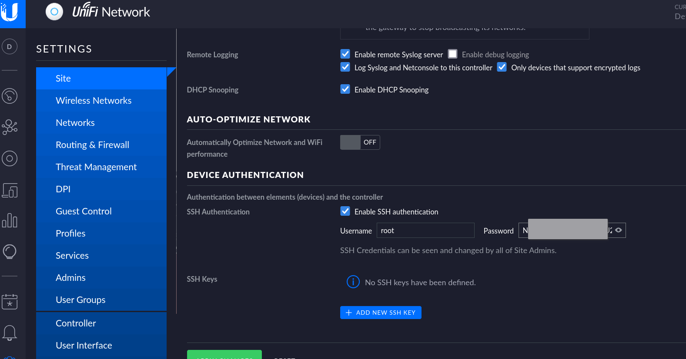

# Landing page
10.129.96.149:8080 redirects:
https://10.129.96.149:8443/manage/account/login?redirect=%2Fmanage

There is a UniFi (6.4.54) login page.

The cert is issued by Ubiquiti, but is expired.

# Logging in as administrator
The attacker was able to edit the mongo administrator hashed password to a known password hash. Now the attacker can log in to the UniFi portal. See [[04 - mogo]]

https://10.129.228.29:8443/manage/site/default/settings/site

Root password credentials for SSH are available!

